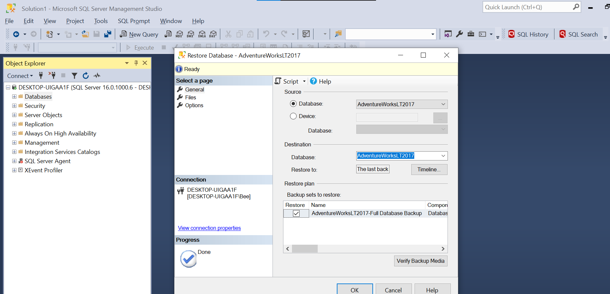

# SQL Server Configuration
  The first ever step is to have a Database that we can work on. In this project I will pick AdventureWorkLT2017

### Table of contents

* [Overview](#overview)
* [Demo](#demo)
* [Contact](#contact)

## Overview
  Open the SSMS (SQL Server Management Studio), restore database with the file in the folder "AdventureWorkDB/AdventureWorksLT2017.bak"

Then you need to create login and set your privilege, you can do that following the file ""./script/createlogin.sql""

## Contact
Please feel free to contact me if you have any questions.
