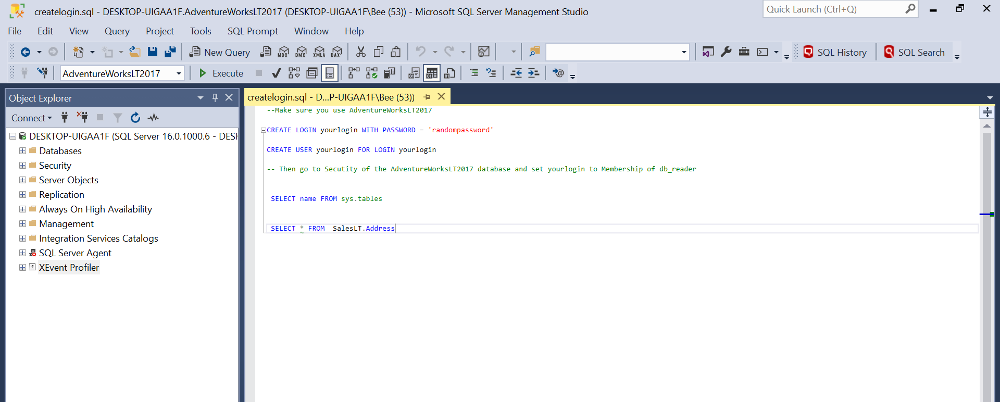
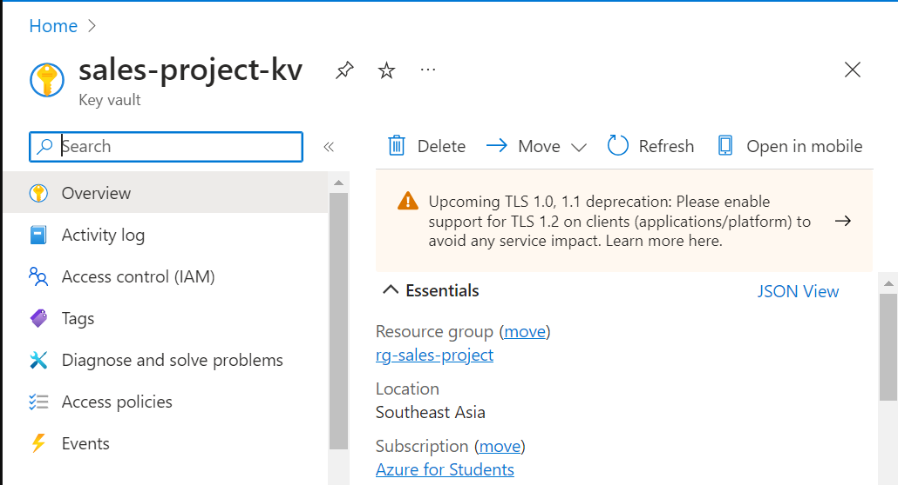

# SQL Server Configuration
  The first ever step is to have a Database that we can work on. In this project I will pick AdventureWorkLT2017

### Table of contents

* [Overview](#overview)
  * [Restore Database](#restore-database)
  * [Create credential](#create-credential)
  * [Store Secrets](#store-secrets)
* [Contact](#contact)

## Overview
### Restore Database
  Open the SSMS (SQL Server Management Studio), restore database with the file in the folder "AdventureWorkDB/AdventureWorksLT2017.bak"

### Create credential
Then you need to create login and set your privilege in SSMS, you can do that following the file "./script/createlogin.sql", now run the simple Select query below to check if it is set or not.

### Store Secrets
It's always a best pratice to store your credential in some place safe and secure, in Azure we have Key Vault to sovle that problem.

Create your Key Vault and choose the Resource Group we have created for this project (If not you can create one from here)

Well done, now you have set up the enviroment for our project! Continue I'm going to show you how to connect from SSMS to Azure, and load the data from 

## Contact
Please feel free to contact me if you have any questions.
