# Azure DataFactory
Azure Data Factory is used for orchestrating and automating the ETL. We can use it and debug on our go.

 There something you should know is how the service in Azure connect to each other, we have Integration Runtime (IR) which is a crucial component that allows you to move data from various source systems to different destination systems. It's essentially a compute infrastructure that provides data integration capabilities across Azure data services, on-premises, and other cloud systems.
Integration Runtime comes in three different types:
1.	Azure Integration Runtime (Azure IR): This is used to connect to Azure services such as Azure SQL Database, Azure Blob Storage, and more. It is auto-managed and maintained by Microsoft.
2.	Self-hosted Integration Runtime (Self-hosted IR): This type of IR is used when you need to connect to on-premises data sources or private network resources. You install and configure it within your own infrastructure. It allows secure communication between your on-premises systems and Azure Data Factory.
3.	Azure-SSIS Integration Runtime (Azure-SSIS IR): This IR is designed for running SQL Server Integration Services (SSIS) packages in Azure. It allows you to migrate, run, and manage your existing SSIS workloads in the Azure cloud.
The choice of Integration Runtime depends on your data integration needs:
•	Use Azure IR when dealing with data sources and destinations that are in the Azure cloud.
•	Use Self-hosted IR when you need to access on-premises data or private network resources.
•	Use Azure-SSIS IR when you have existing SSIS packages that need to be moved to or run in Azure.
You can configure and manage Integration Runtimes in Azure Data Factory to define where your data should be moved and how it should be transformed. It's an essential component for building data pipelines in Azure Data Factory, enabling you to perform tasks like data copying, transformation, and data movement efficiently.

What is Delta format in Databricks?
The Delta format, created by Databricks, builds upon the Parquet format and adds several useful features. These features include the ability to easily track different versions of data and handle schema changes.
With Delta format, you can think of it as a way to keep a historical record of your data. It's like having a document that shows all the changes made to a piece of writing over time. So, if your data changes or updates, Delta format keeps a log of those changes, making it simple to see how your data has evolved.
Additionally, Delta format is really good at handling changes in the structure of your data. Imagine you have a table with specific columns, and later on, you want to add new columns or change the existing ones. Delta format lets you do this without any trouble, making it easy to work with evolving data.
Because of these advantages, Databricks recommends using Delta format to store your data in data lakes. It's a smart choice for keeping your data organized, adaptable, and user-friendly, especially when you need to perform various data analysis and processing tasks.

### Table of contents

* [Overview](#overview)
  * [Integration Runtime](#integration-runtime)
  * [Price for IR](#price-for-ir)
* [Data Pipeline](#data-pipeline)
  * [Look up table name](#look-up)
  * [Copy each table to Bronze layer](#copy-to-bronze)
  * [Transfrom from Bronze to Silver layer](#transform-1)
  * [Transfrom from Silver to Gold layer](#transform-2)
* [Demo](#demo)
* [Contact](#contact)

## Overview
### Integration Runtime
  After you launch the Azure DataFactory, move to the manage tab, and there you will see the AutoResolveIntegrationRuntime (The first one) which I mention above is how Azure service connect to each other in general.
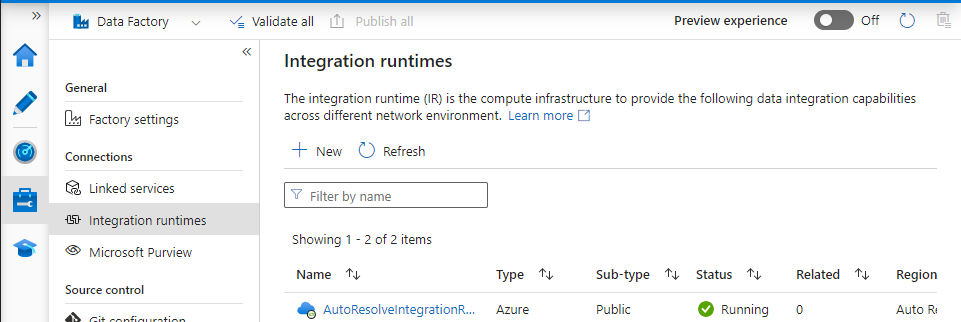

Create new Integration Runtime which we will need to connect to our on-prem SQL Server database.
New->Azure, Self-hosted -> Self-hosted -> Type the name and create. After that you will have something similar to this.
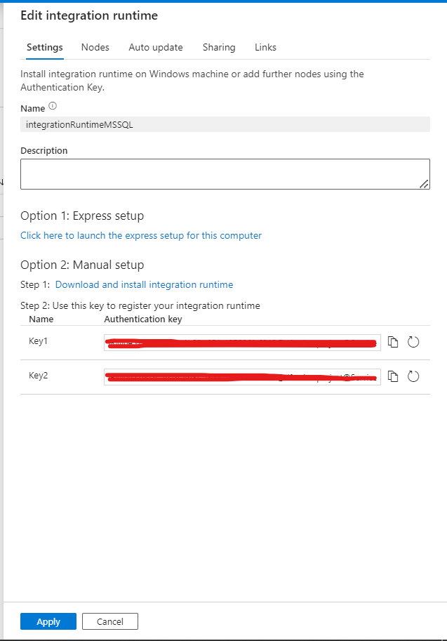

I really recommend to choose the Option 1, then you click install and wait for it, it will automatically connect your local pc to the Cloud enviroment. Kinda amazing right?. Mine connect through VPN so it have a little bit of limited bandwidth but It's not the matter let's go ahead!
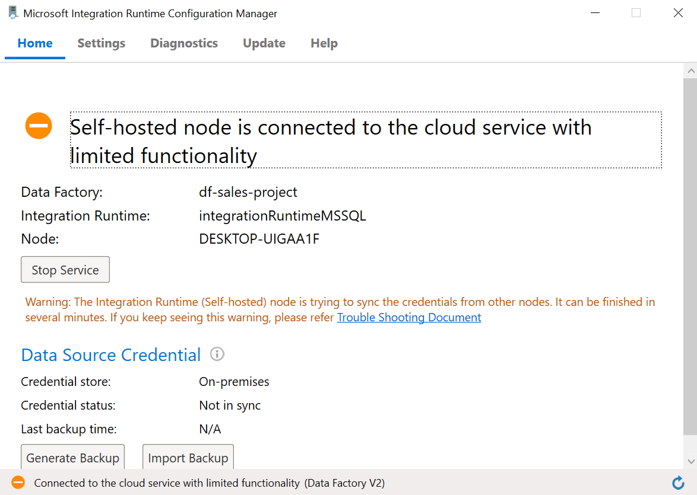

### Price for IR
There something that you should consider when we move on is the cost of the Self-hosted Integration Runtime which will be created to go on in this project, the details is down below:

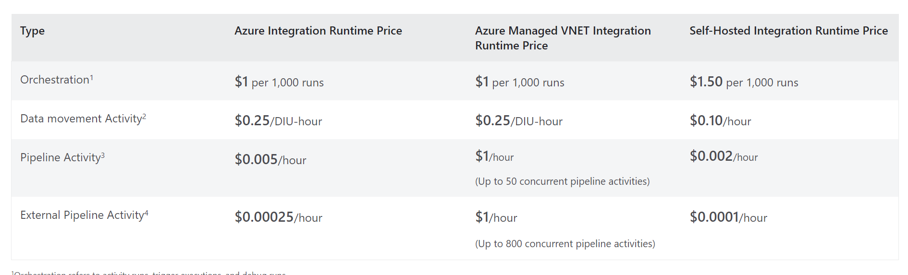

## Data pipeline
Our pipeline gonna look like this, and let's go through each one.

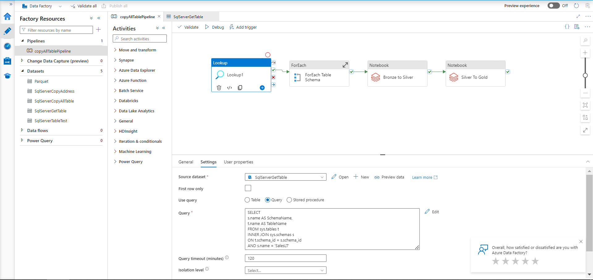

### Look up table name
  Choose the activities tab on your left side and look for 'Look up' activity, drag and drop to the pipeline, then click to that activity in the setting tab -> Source dataset -> create new source -> find SQL Server and choose it.

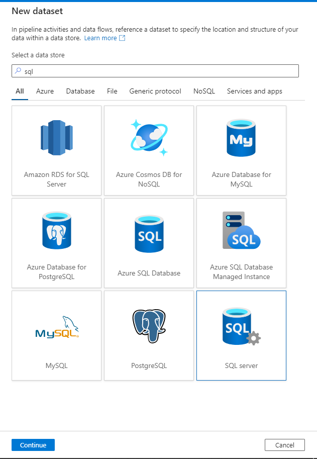

Then create new Linked Service with the configuration below:
  Server name: I create one default SQL Server that's why it's name my computer.
  Database name: AdventureWorksLT2017
  User name and password: We have created one in our On-prem database, and create Key Vault to store that (You can also enter manually, don't be so worried about that) -> Test connection to check everything alright.

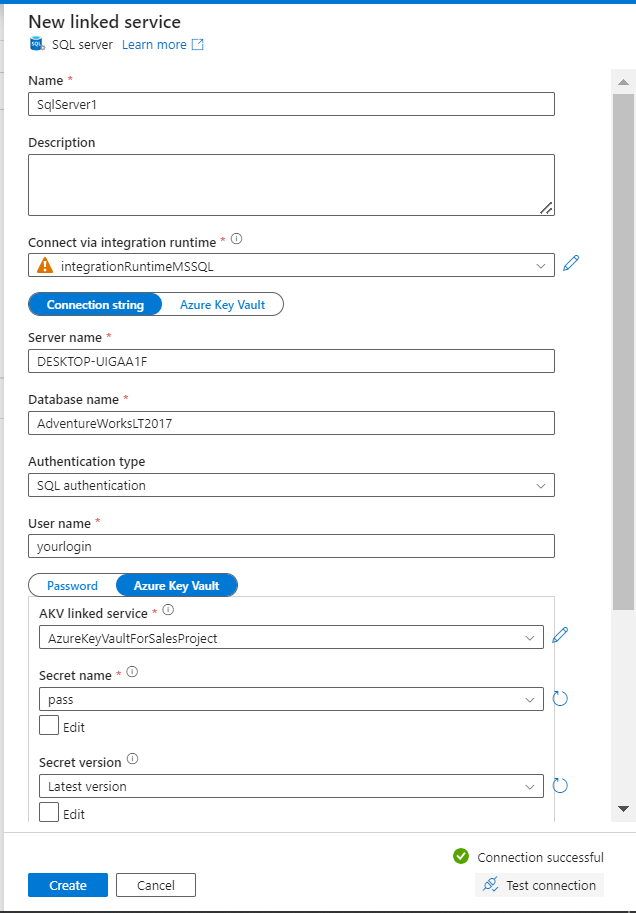

If you use Key Vault to store your secret, there would be some permission you need to set if you encounter this. You can read about it here;

 [KEY VAULT ROLE]( https://stackoverflow.com/questions/69971341/unable-to-create-secrets-in-azure-key-vault-if-using-azure-role-based-access-con)

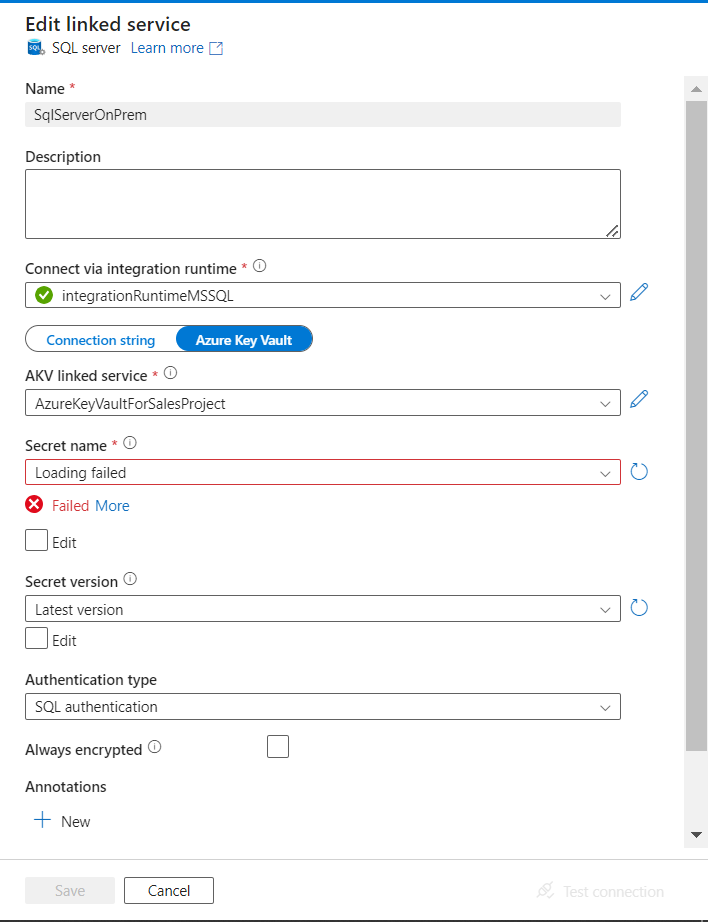

After that in the Setting of Look up activity set the query that i have create in the folder "script/getschema.sql"

### Copy each table to Bronze layer
Create a Foreach activity, then double click into that, in here drag and drop Copy activity, the result of the Look up activity before give us a list of table in the database. So what we do here is from each table copy the data and put it to the bronze layer.

Take the output of Lookup acitivity.
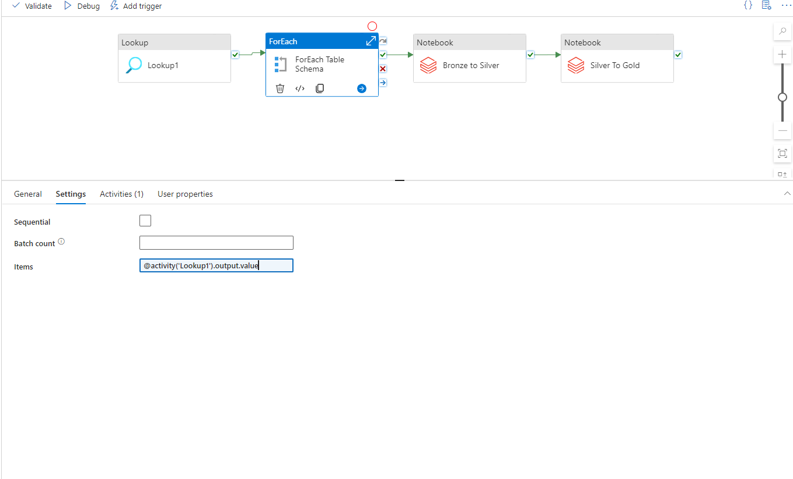
  
Copy activity in Foreach, we need to have table from the source and some where in the sink.
In the source we extract the data from table name.
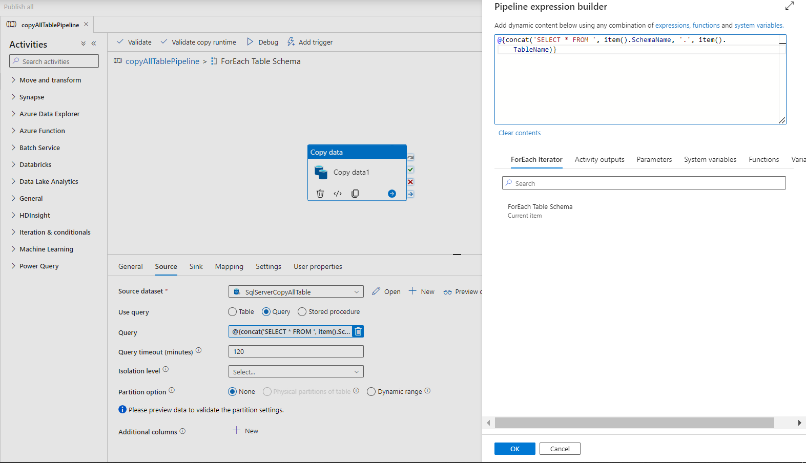
And then store it in the sink.
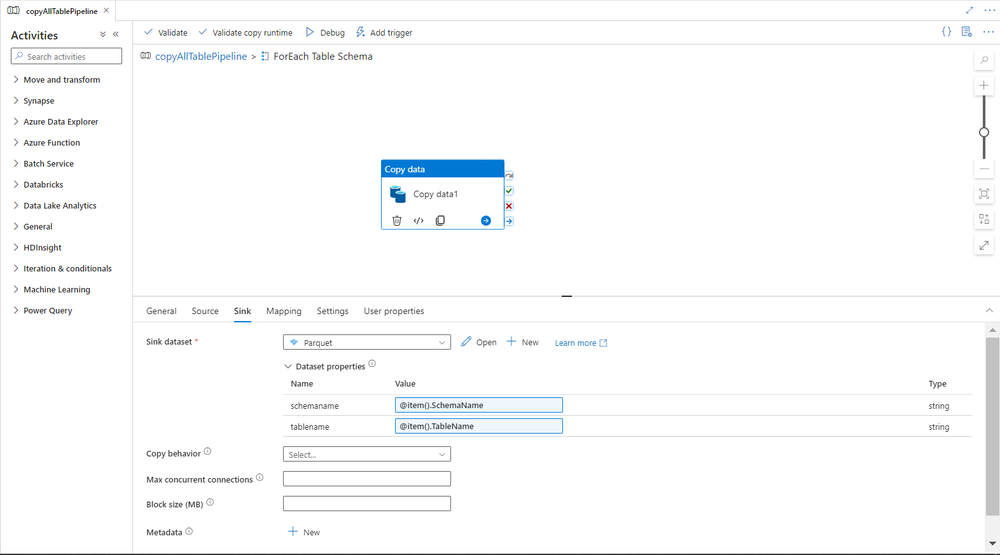
Here you have to have somewhere to store your raw data right? I will pick ADLS Gen 2 for this. Go to the Azure UI, create the Storage Account [An Azure storage account contains all of your Azure Storage data objects: blobs, files, queues, and tables. The storage account provides a unique namespace for your Azure Storage data that's accessible from anywhere in the world over HTTP or HTTPS.](https://learn.microsoft.com/en-us/azure/storage/common/storage-account-overview#:~:text=An%20Azure%20storage%20account%20contains,world%20over%20HTTP%20or%20HTTPS.), and make sure that you enable Hiearchy namespace (which make our folder become tree structure for ease of using)

After that your setting of Storage Account is kinda similar to this.

Create three container which represent our layer:

In the sink Copy activity we will store the data in parquet format which column based and save the data of the file.
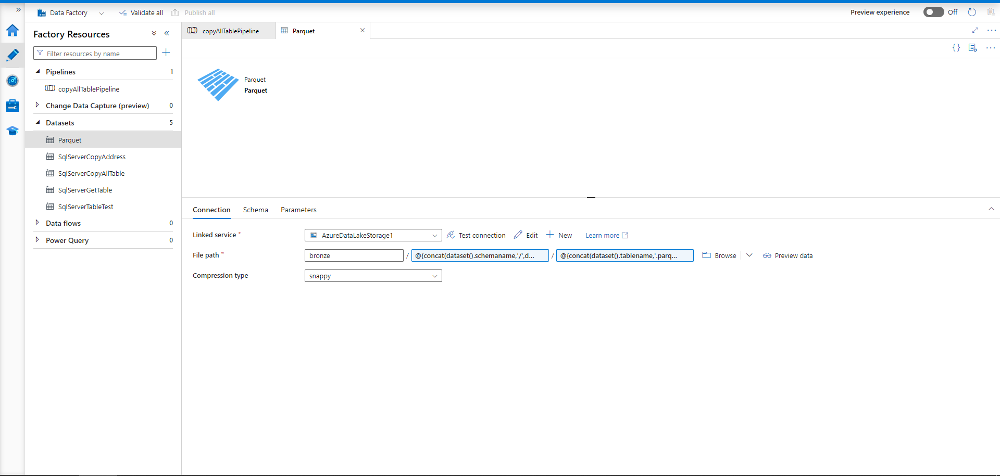
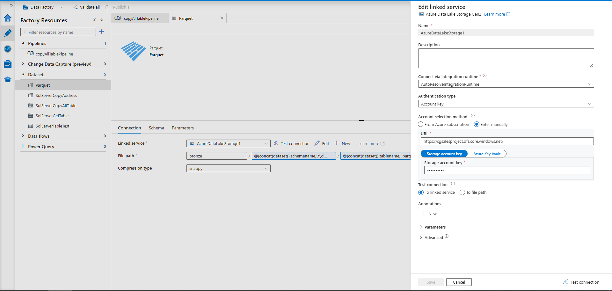

The File path: bronze/@{concat(dataset().schemaname,'/',dataset().tablename)}/@{concat(dataset().tablename,'.parquet')}, which will store the parquet file in a parent structure.
### Transfrom from Bronze to Silver layer
  Now move to the next part, which is using Azure Databrick to transform the data, you have to connect to Azure Databrick somehow right, create two notebooks then create new Databricks Linked Service, and enter your credentials:
  You need to have Access token of Azure Databrick to connect to it, click your mail on the right of your screen->User Setting->Developer->Generate new access token
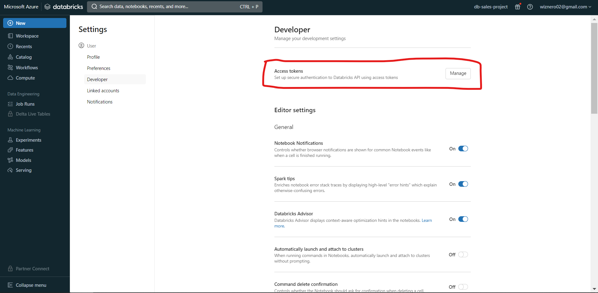
  Now you can connect to your databrick and run some notebooks:
  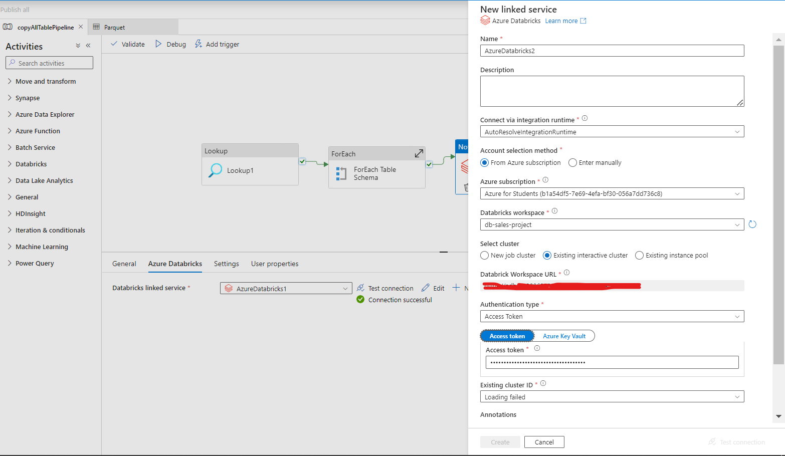

In Azure Databricks, import 3 file .py in the folder "Azure Databricks" to it, then the sequence is:
1. storagemount.py
2. bronzeTosilver.py
3. silverTogold

In each file, I have already put documentation to each code, and you can follow along. And change in storagemount.py you need to change the credentials to connect to your service:
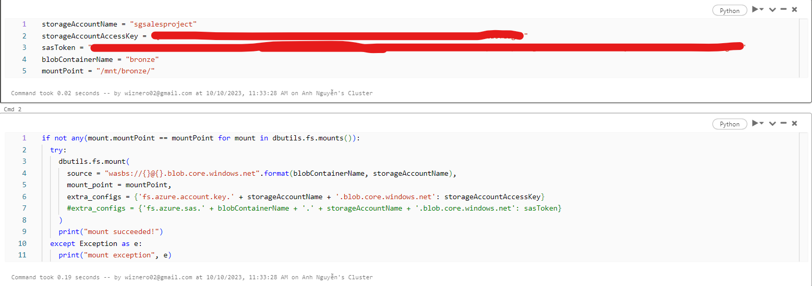

### Transfrom from Silver to Gold layer
In the setting of the two notebooks remember to browse to the file we have imported and choose the right note book. 
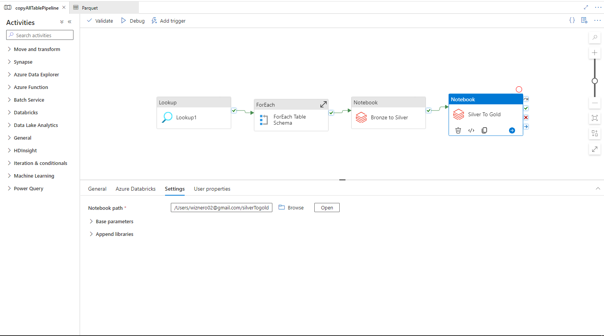

And now the pipeline is already 2/3 of the path! What would be next you wonder? We gonna take the data from gold layer which a final cleaneast form of data to Synapse Analystic, On Cloud SQL Database, and use Power BI to connect and visualize it!!
## Demo
- Click the link to the Demo:  
  [Link](https://www.youtube.com/watch?v=xLFjE2WJaoM)

## Contact
Please feel free to contact me if you have any questions.

