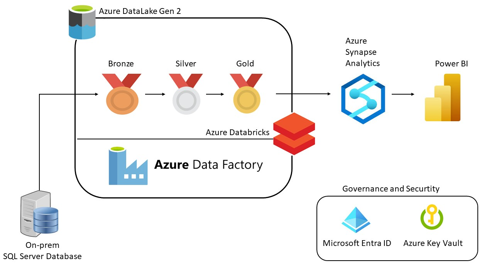
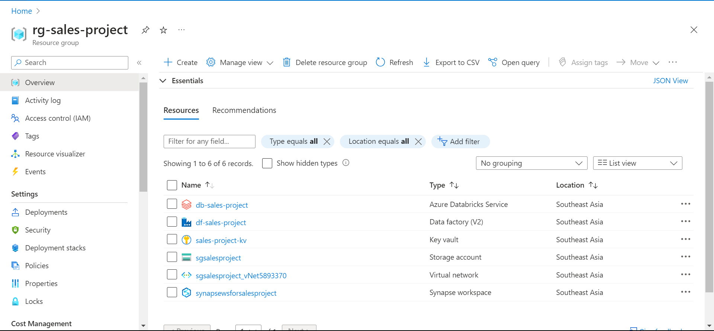
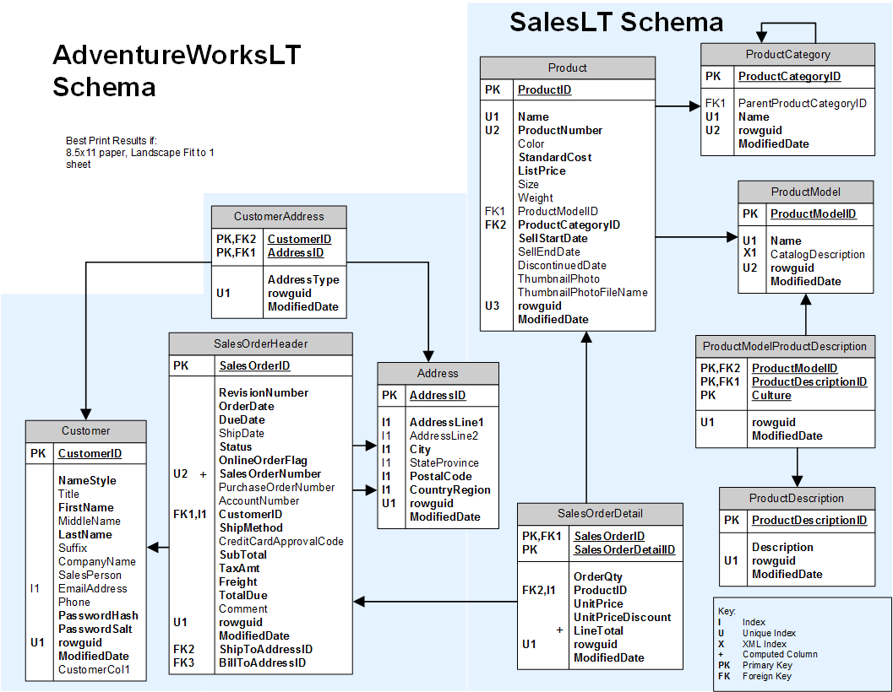
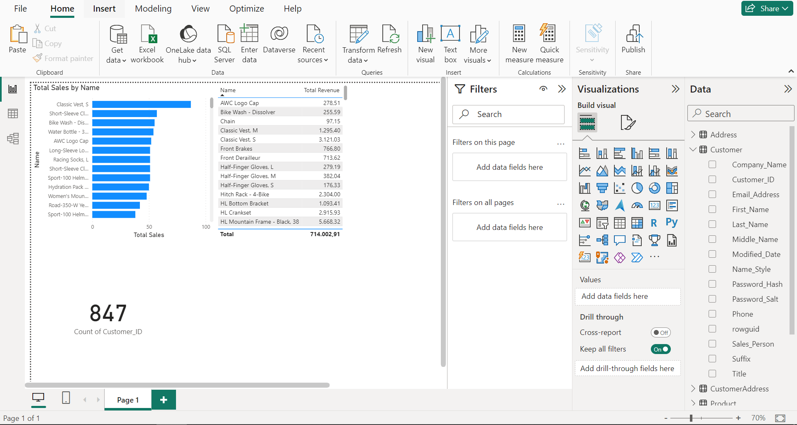
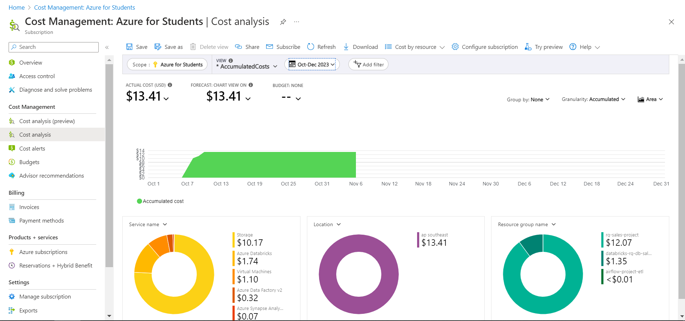

# Azure end-to-end Data Pipeline from On-prem to Report 

This project is simply about making and running a complete system that handles data. We use Azure services to change, store, and visualize data.
A good use case of this project is migrating the on-prem database to Cloud. I will guide you step by step to complete this project in each section. Let's go!

### Table of contents

* [Architecture diagram](#architecture-diagram)
* [Overview](#overview)
* [How it works](#how-it-works)
* [Prerequisites](#prerequisites)
* [Quick Start](#quick-start)
    * [Azure Integration Runtime](#azure-integration-runtime)
    * [Azure Data Lake Storage Gen2](#azure-datalake)
    * [Azure Databricks](#azzure-databrick)
    * [Azure Data Factory](#azure-data-factory)
    * [Azure Synapse Analytics](#azure-synapse-analytics)
    * [Power BI](#power-bi)
* [Demo](#demo)
* [Contact](#contact)

## Architecture diagram

## Overview

### Resource group

### Database Schema

### Building report

### Data Lake Architecture
The data lake architecture consists of three layers:

Bronze Layer:
This is the raw data layer where data is ingested from various source systems. The data in this layer is an exact copy of the source data.

Silver Layer:
This is the cleaned and processed data layer. Data from the Bronze layer is transformed and loaded into this layer. Simple transformations like changing column names and types for compatibility in the cloud are performed in this layer.

Gold Layer:
This is the final, cleanest form of data which is ready for consumption by end users or downstream systems. The data in this layer is highly aggregated and optimized for reporting and analytics.

## How it works
### Data Sources:

SQL Server On-Prem: The primary source of transactional data.

### Data Ingestion:

Azure Integration Runtime: Connects on-premises SQL Server to Azure services.

Azure Data Lake Storage Gen2: Serves as the data lake for ingesting raw data.

### Data Transformation:

Azure Databricks: Powers ETL (Extract, Transform, Load) processes for data processing.

### Data Visualization:

Power BI: Provides a rich and interactive interface for data exploration and visualization.

### Orchestration and Workflow:

Azure Data Factory: Manages and schedules data pipeline workflows.

Azure Synapse Analytics: Provides a unified experience to ingest, prepare, manage, and serve data for immediate business intelligence and machine learning needs.

  
## Prerequisites
What you need to run the project:

- I have play around a lot in this project and the cost is approximate about $15.

- Azure Subscription - In this project I will use my Azure Students Subcriptions which will give us $100 free credits.
- Azure Data Factory - Azure Data Factory is used for orchestrating and automating the data pipeline.

- Azure Databricks - Azure Databricks is used for data transformation and processing.

- Azure Synapse Analytics - is used for data warehousing and analytics.

- Power BI - is used for data visualization and reporting.

- Azure Data Lake Storage Gen2: is used as the data lake for this project.

- Azure Databricks: is used for data transformation and processing. 

## Demo
- Click the link to the Demo:  
  [Link](https://www.youtube.com/watch?v=xLFjE2WJaoM)

## Contact
Please feel free to contact me if you have any questions.
